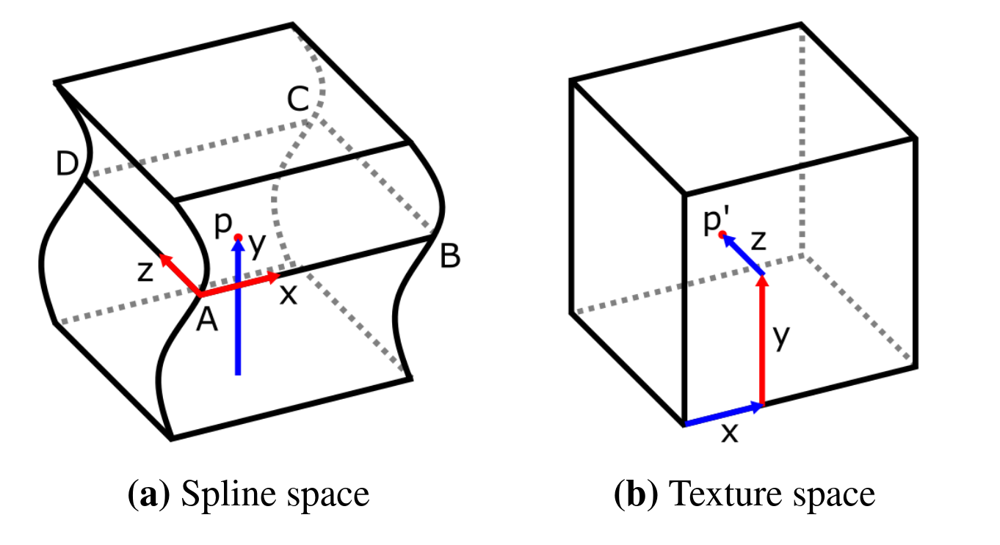

HPB Voxel Spline Animation Demo
==================

This repository contains the code of our Bachelor's Honours Programme research on voxel animation/deformation.
Volumetric models are deformed through a *Spline map* (inspired by the *Shell map*), in which sampled coordinates are transformed according to splines.

Refer to the paper and code for more details on the method and algorithm:

[[Paper]](paper.pdf): **Spline Based Shell Mapping for Smooth Voxel Deformation**

Beware that this was our first 'real' paper, so the writing is not quite up to standard.

## Code Outline

Source code: `src/`

Shaders: `assets/*.{vert,frag}`

Data: `assets/`

2d version: `2d_debug/`

External libraries: `external/`

The entire rendering algorithm is contained within `assets/spline_map.frag`, where the uniforms are supplied from `src/scene/spline_map_scene.hpp`.
Debug code for most of the rendering algorithm is available in `src`.

## Building

To build the project, first run Premake, see https://premake.github.io/.
This can be downloaded from the website or through your favorite package manager.

Commands:
- Visual Studio 2017: premake5.exe vs2017
- Makefiles: ./premake5 gmake2

Once the build files have been generated, you can build the project.

- Windows: Use the provided Visual Studio solution (SimpleVolume.sln)
- Linux: Use the included make files (just run `make`).

## Demo Usage

- Hold left mouse button to orbit camera
- WASD to move the camera around
- Scroll wheel to move closer/further
- Escape to escape
- TAB to enter debug mode
- Space to emit debug rays 
- Backspace to return to the camera transformation from where the debug rays were emitted
